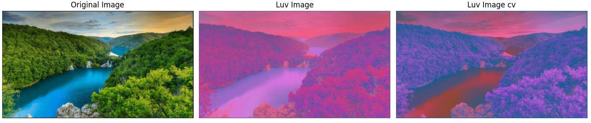
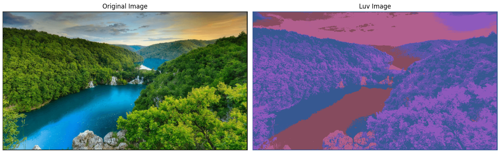
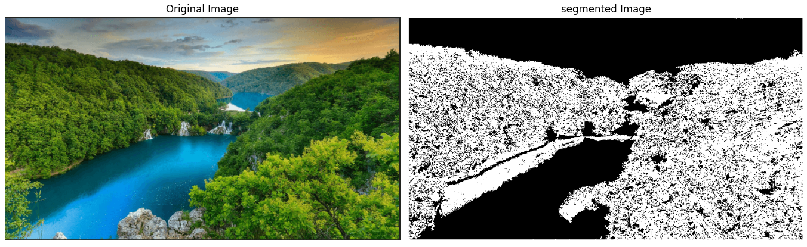
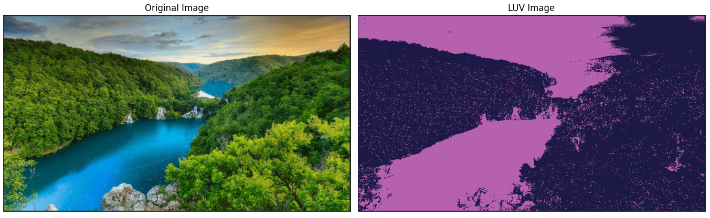
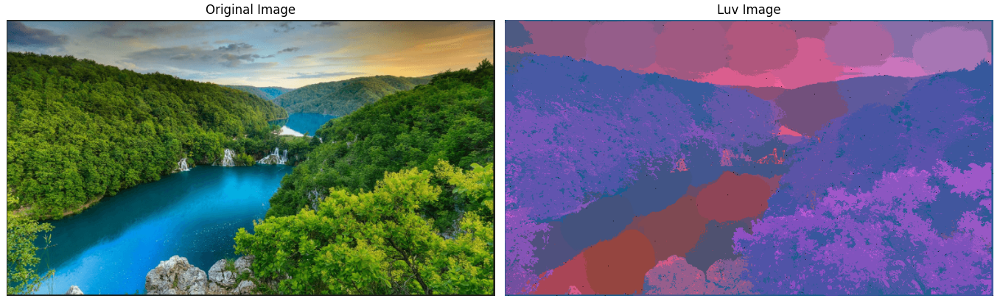

## Segmentation using clustering

## Mapping RGB to LUV

#### 4 Clustering methods implementation:

1. K-Means
2. Region Growing
3. Agglomerative Clustering
4. Mean-Shift

There are mainly 2 parameters in some Clustering methods:

* Number of Clusters: to specify how many clusters you need in the output image.
* Threshold: to threshold the output image in specific level in some methods.

## 2.1 - K-Means Clustring &#x2611;

- Computation time of K-Means Clustring = 236.74525 seconds.

## 2.2 - Region Growing Clustring &#x2611;

- Computation time of Region Growing Clustring = 1.79785 seconds.

## 2.3 - Agglomerative Clurstering &#x2611;

- Computation time of Agglomerative Clurstering = 92.60517 seconds.

## 2.4 - Mean Shift Clurstering &#x2611;

- Computation time of Mean Shift Clurstering is highly expensive = 2494.09126 seconds (around 42 minutes).
